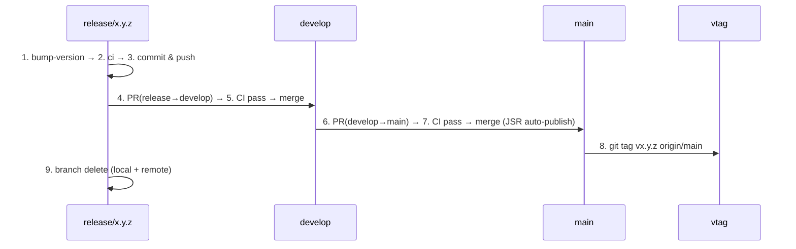

# リリース手順ガイド

version bump → CI → PR → merge → vtag の一連のリリースフローを管理する。ブランチ戦略は `/branch-management`、CI詳細は `/local-ci` を参照。

## 連続マージ禁止

誤マージ防止のため、各PR作成後にユーザーの明示的指示を待ってから次のマージに進む。

- 禁止: 指示なし連続マージ、曖昧な指示での main 直行、独自判断の develop→main マージ
- 正: 各PR後に報告→「develop まで」「main まで」等の明示指示を確認→vtag も指示待ち

## バージョン管理

CIで一致を自動チェックするため、`deno.json`（JSRバージョン）と `src/version.ts`（定数）の2ファイルを `deno task bump-version` で同時更新する。

```bash
deno task bump-version          # release/* ブランチ名から自動検出
deno task bump-version 1.2.3    # 明示指定も可
```

バージョン番号: パッチ(x.y.Z)=バグ修正、マイナー(x.Y.0)=後方互換の新機能、メジャー(X.0.0)=破壊的変更。

## リリースフロー



### ステップ 1: バージョンアップ

```bash
# 新規作成: git checkout develop && git checkout -b release/x.y.z
# 既存: git checkout release/x.y.z
deno task bump-version
grep '"version"' deno.json
grep 'export const BREAKDOWN_LOGGER_VERSION' src/version.ts
```

### ステップ 2: ローカルCI + GitHub CI 事前再現

`deno task ci` に加え、GitHub CI固有の差分を事前に潰す。詳細は `/local-ci` 参照。

```bash
deno task ci                                       # 基本CI
deno fmt --check                                   # md含む全ファイルfmt
deno test --allow-env --allow-read --allow-write   # CI同等の権限フラグ
# version-check: deno.json >= 最新タグ
git fetch --tags
LATEST_TAG=$(git describe --tags --abbrev=0 2>/dev/null || echo "v0.0.0")
CURRENT="v$(grep '"version"' deno.json | head -1 | sed 's/.*"\([0-9.]*\)".*/\1/')"
echo "deno.json=$CURRENT, latest_tag=$LATEST_TAG"
```

v1.1.0での教訓:

| 見落とし | 事前チェック |
| --- | --- |
| md の fmt 差分 | `deno fmt --check` |
| テスト権限不足（CI は制限付き） | CI と同じフラグでテスト |
| version-check fail（deno.json < 最新タグ） | タグと deno.json の比較 |
| publish.yml と test.yml のフラグ乖離 | 両 yml の test フラグを目視 |

### ステップ 3: コミット & プッシュ

```bash
git add deno.json src/version.ts
git commit -m "chore: bump version to x.y.z"
git push -u origin release/x.y.z
```

### ステップ 4-5: release/* → develop

```bash
gh pr create --base develop --head release/x.y.z \
  --title "Release x.y.z: <変更概要>" \
  --body "## Summary\n- <変更点>\n\n## Version\n- x.y.z"
gh pr checks <PR番号> --watch    # CI全pass待ち
gh pr merge <PR番号> --merge
```

### ステップ 6-7: develop → main

```bash
gh pr create --base main --head develop \
  --title "Release x.y.z" \
  --body "Release version x.y.z to production"
gh pr checks <PR番号> --watch    # CI全pass待ち
gh pr merge <PR番号> --merge     # JSR publish 自動実行
```

### ステップ 8: vtag 作成

vtag は main コミットに付与するため、fetch 後に origin/main を指定する。

```bash
git fetch origin main
git tag vx.y.z origin/main
git push origin vx.y.z
```

### ステップ 9: マージ済みブランチ削除

main マージ完了 + vtag 作成済みの `release/*` を削除する。削除基準の詳細は `/branch-management` 参照。

```bash
# 削除対象の確認
git branch --merged main | grep 'release/'
git branch -r --merged origin/main | grep 'release/'

# 削除実行
git branch -D release/x.y.z
git push origin --delete release/x.y.z
```

## ドキュメント更新

リリース前に `/update-docs` で必要なドキュメントを更新する: CLI変更→`--help`必須、新機能→README、設定変更→スキーマ説明。

## CI バージョンチェック

| ワークフロー | チェック内容 | 失敗時メッセージ |
| --- | --- | --- |
| test.yml | deno.json と version.ts の一致（全ブランチ） | `Version mismatch: deno.json=X, version.ts=Y` |
| test.yml | ブランチ名とバージョンの一致（release/*のみ） | `Branch version mismatch: branch=X, deno.json=Y` |
| version-check.yml | deno.json >= 最新 git タグ | `deno.json version ($CURRENT) is older than latest tag` |

失敗時は `deno task bump-version` で一括修正してコミット・プッシュする。

## トラブルシューティング

| 症状 | 原因と対処 |
| --- | --- |
| GitHub CI fail | `gh pr checks` → `gh run view <run-id> --log-failed` → release/* で修正 & push |
| publish.yml だけ fail | test.yml と publish.yml の test フラグ不一致 → `grep -n 'deno test' .github/workflows/{test,publish}.yml` で比較して同期 |
| JSR publish スキップ | deno.json バージョンが既存と同じ → バージョンを上げて再リリース |
| vtag が古いコミット | `git tag -d vx.y.z && git push origin :refs/tags/vx.y.z` → `git tag vx.y.z origin/main && git push origin vx.y.z` |

## クイックリファレンス

```
1. deno task bump-version                          # deno.json + version.ts 更新
2. deno task ci && deno fmt --check                # ローカルCI + fmt
3. deno test --allow-env --allow-read --allow-write # CI同等テスト
4. git commit & push
5. gh pr create (release→develop) → checks → merge
6. gh pr create (develop→main) → checks → merge   # JSR auto-publish
7. git tag vx.y.z origin/main && git push origin vx.y.z
8. git branch -D release/x.y.z && git push origin --delete release/x.y.z

関連: /local-ci /ci-troubleshooting /branch-management /git-gh-sandbox /update-docs
```
