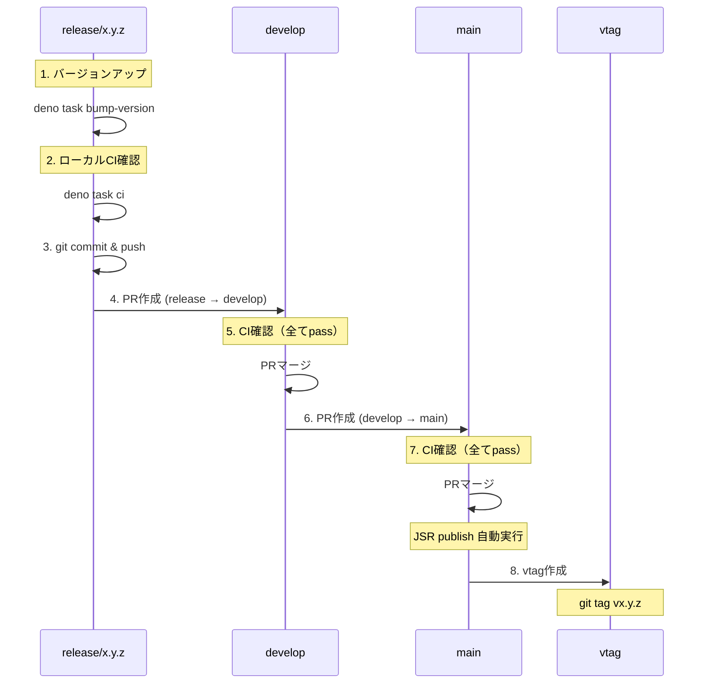

# リリース手順ガイド

## 責務

リリースフロー全体を管理する（version bump → tag → PR → merge の手順）。

- ブランチ戦略・命名規則の詳細は `/branch-management` skill を参照
- CI 実行方法・エラー対処の詳細は `/local-ci` skill を参照

## リリースブランチ作成時のチェックリスト

`release/*` ブランチを作成したら、必ず以下を実行:

```bash
# 1. バージョン自動更新（ブランチ名から検出）
deno task bump-version

# 2. 確認
grep '"version"' deno.json
grep 'BREAKDOWN_LOGGER_VERSION' src/version.ts

# 3. ローカルCI
deno task ci

# 4. コミット & プッシュ
git add deno.json src/version.ts
git commit -m "chore: bump version to x.y.z"
git push -u origin release/x.y.z
```

## ドキュメント更新（リリース前）

`/update-docs` スキルを使用:

- CLI オプション変更 → `--help` 必須、README 推奨
- 新機能 → README に簡潔な説明とサンプル
- 設定変更 → スキーマ説明、README/docs

### チェックリスト

```
□ 必要なドキュメントを更新（/update-docs）
  □ CLI変更 → --help 出力確認
  □ 新機能 → README.md
  □ 設定変更 → スキーマ説明
```

**重要**: `deno task bump-version` は release/*
ブランチ名からバージョンを自動検出する。 手動指定も可能:
`deno task bump-version 1.10.2`

## 重要: 連続マージの禁止事項

`release/*` → develop → main
への連続マージは、必ずユーザーの明示的な指示を受けてから実行すること。

禁止事項:

- ユーザーの指示なしに連続マージを実行
- 「リリースして」等の曖昧な指示で main まで一気にマージ
- 独自判断での develop → main マージ

正しい手順:

1. 各 PR 作成後、ユーザーに報告して次の指示を待つ
2. 「develop まで」「main まで」等の明示的な指示を確認
3. vtag 作成もユーザーの指示を待つ

## トリガー条件

以下の操作について議論・作業する際に自動的に実行:

- `release/*` ブランチへの push
- `release/*` → `develop` への PR 作成・マージ
- `develop` → `main` への PR 作成・マージ
- バージョンアップ・リリースに関する議論
- vtag の作成

## バージョン管理ファイル

このプロジェクトでは以下の2ファイルでバージョンを管理:

| ファイル         | 用途                                                   |
| ---------------- | ------------------------------------------------------ |
| `deno.json`      | JSR パッケージバージョン（`"version": "x.y.z"`）       |
| `src/version.ts` | バージョン定数（`BREAKDOWN_LOGGER_VERSION = "x.y.z"`） |

**重要**: 両ファイルのバージョンは必ず一致させること。CIで自動チェックされる。

### bump-version スクリプト

`scripts/bump_version.ts` が両ファイルを同時に更新する:

```bash
# release/* ブランチ名から自動検出
deno task bump-version

# 明示的にバージョン指定
deno task bump-version 1.2.3
```

## バージョンアップ手順

### 1. バージョン番号の決定

```
パッチ (x.y.Z): バグ修正、ドキュメント改善
マイナー (x.Y.0): 新機能追加（後方互換あり）
メジャー (X.0.0): 破壊的変更
```

### 2. ファイル更新

```bash
# 自動更新（推奨）
deno task bump-version

# 手動更新の場合は2ファイルとも変更すること
# deno.json: "version": "x.y.z"
# src/version.ts: export const BREAKDOWN_LOGGER_VERSION = "x.y.z";
```

### 3. 確認コマンド

```bash
# バージョン一致確認
grep '"version"' deno.json | head -1
grep 'BREAKDOWN_LOGGER_VERSION' src/version.ts | grep export
```

## リリースフロー

### フロー図



### 手順詳細

#### ステップ 0: 準備

```bash
# 作業ブランチを release/* に統合済みか確認
git checkout release/x.y.z
git log --oneline -10
```

#### ステップ 1: release/* ブランチでバージョンアップ

```bash
# develop から新規作成する場合
git checkout develop
git checkout -b release/x.y.z

# または既存 release/* で作業
git checkout release/x.y.z
```

バージョン更新（自動スクリプト使用）:

```bash
# ブランチ名から自動検出してバージョン更新
deno task bump-version

# または明示的に指定
deno task bump-version x.y.z

# 確認
grep '"version"' deno.json
grep 'export const BREAKDOWN_LOGGER_VERSION' src/version.ts
```

#### ステップ 2: ローカルCI確認（GitHub CI 事前再現）

**重要**: プッシュ前に必ずローカルでCIを通すこと。実行方法の詳細は `/local-ci`
skill を参照。

`deno task ci` だけではなく、GitHub CI との差分を事前に潰す。

```bash
# 1. ローカルCI（基本）
deno task ci

# 2. GitHub CI 再現チェック（ローカルCIに含まれない項目）
#    a. markdown を含む全ファイルの fmt チェック
deno fmt --check
#    b. GitHub CI と同じ権限フラグでテスト
deno test --allow-env --allow-read --allow-write
#    c. version-check: deno.json >= 最新タグ であること
git fetch --tags
LATEST_TAG=$(git describe --tags --abbrev=0 2>/dev/null || echo "v0.0.0")
CURRENT="v$(grep '"version"' deno.json | head -1 | sed 's/.*"\([0-9.]*\)".*/\1/')"
echo "deno.json=$CURRENT, latest_tag=$LATEST_TAG"
```

**よくある見落とし（v1.1.0 リリースでの教訓）**:

| 見落とし                             | 原因                                        | 事前チェック                |
| ------------------------------------ | ------------------------------------------- | --------------------------- |
| markdown の fmt 差分                 | `deno task ci` が md を含まない場合がある   | `deno fmt --check`          |
| テスト権限不足                       | ローカルは `--allow-all` だが CI は制限付き | CI と同じフラグでテスト実行 |
| version-check fail                   | deno.json バージョン < 最新タグ             | タグと deno.json の比較     |
| publish.yml と test.yml のフラグ乖離 | workflow 修正が片方だけで漏れる             | 両 yml の test フラグを目視 |

#### ステップ 3: コミット & プッシュ

```bash
git add deno.json src/version.ts
git commit -m "chore: bump version to x.y.z"
git push -u origin release/x.y.z
```

**注意**: サンドボックス制限については `/git-gh-sandbox` skill を参照

#### ステップ 4: release/* → develop PR

```bash
gh pr create --base develop --head release/x.y.z \
  --title "Release x.y.z: <変更概要>" \
  --body "## Summary
- <変更点>

## Version
- x.y.z"
```

#### ステップ 5: CI確認 & develop へマージ

**重要**: マージ前にPRのCIが全てパスすることを確認

```bash
# CI確認（全てpassになるまで待機）
gh pr checks <PR番号> --watch

# CIがpassしたらマージ
gh pr merge <PR番号> --merge
```

#### ステップ 6: develop → main PR

```bash
gh pr create --base main --head develop \
  --title "Release x.y.z" \
  --body "Release version x.y.z to production"
```

#### ステップ 7: CI確認 & main へマージ

**重要**: マージ前にPRのCIが全てパスすることを確認

```bash
# CI確認（全てpassになるまで待機）
gh pr checks <PR番号> --watch

# CIがpassしたらマージ
gh pr merge <PR番号> --merge
```

**自動処理**: main マージ時に JSR publish が自動実行される

#### ステップ 8: vtag 作成

```bash
# main の最新コミットを取得
git fetch origin main

# vtag 作成 & push
git tag vx.y.z origin/main
git push origin vx.y.z
```

**重要**: vtag は必ず main ブランチのコミットに付与する

#### ステップ 9: クリーンアップ（ブランチ削除）

マージ後のブランチ削除を行う。削除判断基準・手順の詳細は `/branch-management`
skill を参照。

```bash
# release ブランチ削除例
git branch -D release/x.y.z
git push origin --delete release/x.y.z
```

## CI バージョンチェック

`.github/workflows/test.yml` で以下を自動チェック:

### チェック内容

| チェック項目                   | 対象ブランチ   | 失敗時のエラー                                   |
| ------------------------------ | -------------- | ------------------------------------------------ |
| deno.json と version.ts の一致 | 全ブランチ     | `Version mismatch: deno.json=X, version.ts=Y`    |
| ブランチ名とバージョンの一致   | release/* のみ | `Branch version mismatch: branch=X, deno.json=Y` |

`.github/workflows/version-check.yml` で追加チェック:

| チェック項目               | 失敗時のエラー                                          |
| -------------------------- | ------------------------------------------------------- |
| deno.json >= 最新 git タグ | `deno.json version ($CURRENT) is older than latest tag` |

### チェックを通すための確認コマンド

```bash
# 現在のブランチ名からバージョンを確認
git branch --show-current | sed 's|release/||'

# deno.json のバージョン
grep '"version"' deno.json | head -1 | sed 's/.*"\([0-9.]*\)".*/\1/'

# version.ts のバージョン
grep 'export const BREAKDOWN_LOGGER_VERSION' src/version.ts | sed 's/.*"\([0-9.]*\)".*/\1/'

# 3つが全て一致することを確認
```

### チェック失敗時の対処

```bash
# バージョン不一致の場合: bump-version で一括修正
deno task bump-version

# または手動修正
git add deno.json src/version.ts
git commit -m "fix: correct version to x.y.z"
git push origin release/x.y.z
```

## クイックリファレンス

```
バージョンアップ:
  1. deno task bump-version  ← deno.json + src/version.ts を一括更新
  2. deno task ci  ← ローカルCIを通す（重要）
  3. git commit -m "chore: bump version to x.y.z"

ドキュメント更新（リリース前）:
  /update-docs → README 等を必要に応じて更新

GitHub CI 事前再現（push前に必ず実施）:
  1. deno fmt --check                    ← md 含む全ファイル
  2. deno test --allow-env --allow-read --allow-write  ← CI と同じフラグ
  3. version-check: deno.json >= 最新タグ確認

リリースフロー:
  1. release/* → develop PR作成
  2. gh pr checks <PR番号> --watch  ← CIがpassするまで待機
  3. gh pr merge <PR番号> --merge
  4. develop → main PR作成
  5. gh pr checks <PR番号> --watch  ← CIがpassするまで待機
  6. gh pr merge <PR番号> --merge (JSR publish 自動)
  7. vtag作成: git tag vx.y.z origin/main && git push origin vx.y.z
  8. クリーンアップ: ブランチ削除（/branch-management 参照）

関連Skill:
  - CI実行・エラー対処 → /local-ci, /ci-troubleshooting
  - ブランチ戦略・削除判断 → /branch-management
  - サンドボックス制限 → /git-gh-sandbox
```

## トラブルシューティング

### GitHub CI fail 時の事前防止と対処

#### 事前防止（ステップ 2 で実施）

GitHub CI 固有の失敗パターンはローカルで事前に再現・防止できる。 ステップ 2
の「GitHub CI 再現チェック」を必ず実施すること。

#### それでも fail した場合の対処

```bash
# 1. どのジョブが fail か確認
gh pr checks <PR番号>

# 2. 失敗ログを確認
gh run view <run-id> --log-failed

# 3. release/* ブランチで修正 & push（PR の CI が自動再実行される）
git add <修正ファイル>
git commit -m "fix: <CI失敗の原因を簡潔に>"
git push origin release/x.y.z
```

#### workflow ファイル修正時の注意

**publish.yml と test.yml のフラグは必ず同期する**。片方だけ修正すると vtag push
時に publish.yml 側で fail する（v1.1.0 での実例）。

```bash
# 確認: 両ファイルの test コマンドを比較
grep -n 'deno test' .github/workflows/test.yml .github/workflows/publish.yml
# 両方とも --allow-env --allow-read --allow-write であること
```

### JSR publish がスキップされた

原因: deno.json のバージョンが既存と同じ

```bash
# 確認
gh run view <run-id> --log | grep -i "skip"

# 対処: バージョンを上げて再リリース
```

### CI バージョンチェック失敗

原因: deno.json と version.ts の不一致、またはブランチ名との不一致

```bash
# 一括修正
deno task bump-version

# 確認
grep '"version"' deno.json
grep 'export const BREAKDOWN_LOGGER_VERSION' src/version.ts
git branch --show-current
```

### vtag が古いコミットを指している

```bash
# 確認
git show vx.y.z --oneline

# 対処: タグ削除 & 再作成
git tag -d vx.y.z
git push origin :refs/tags/vx.y.z
git tag vx.y.z origin/main
git push origin vx.y.z
```
