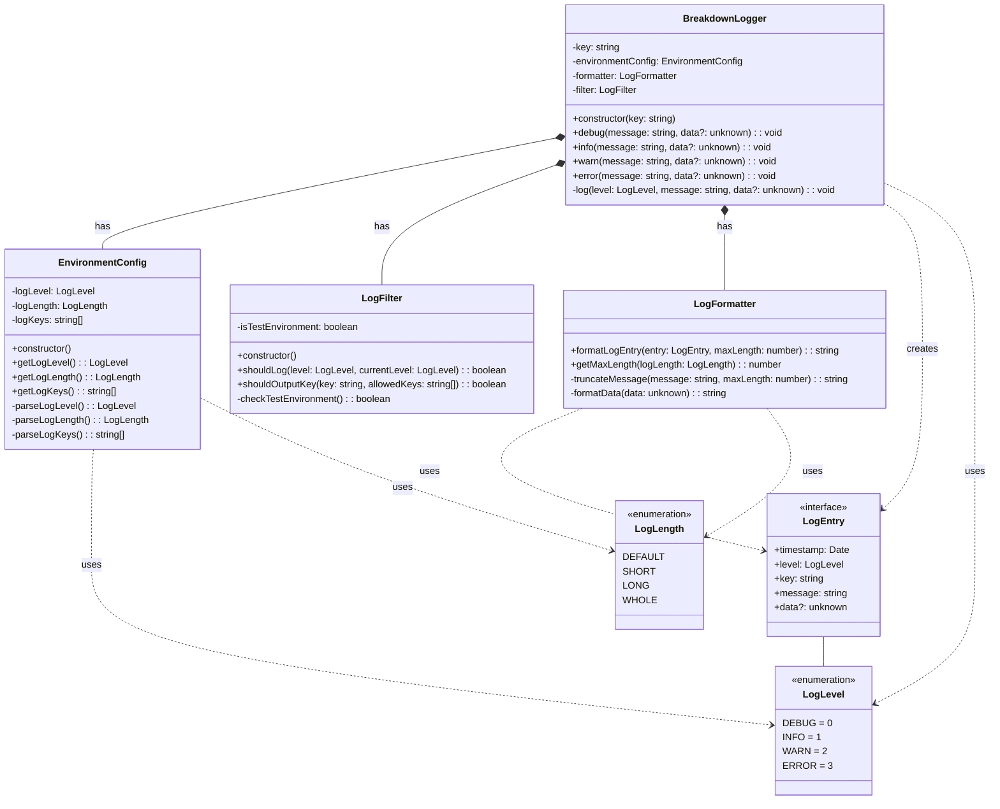
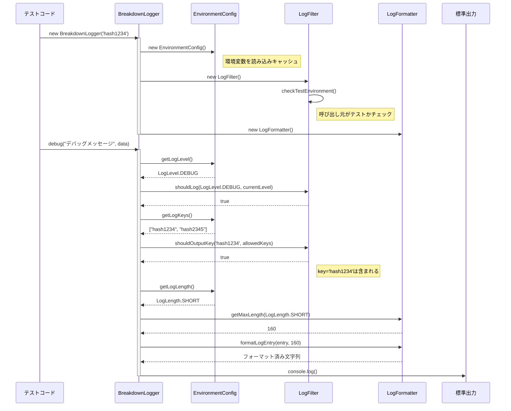
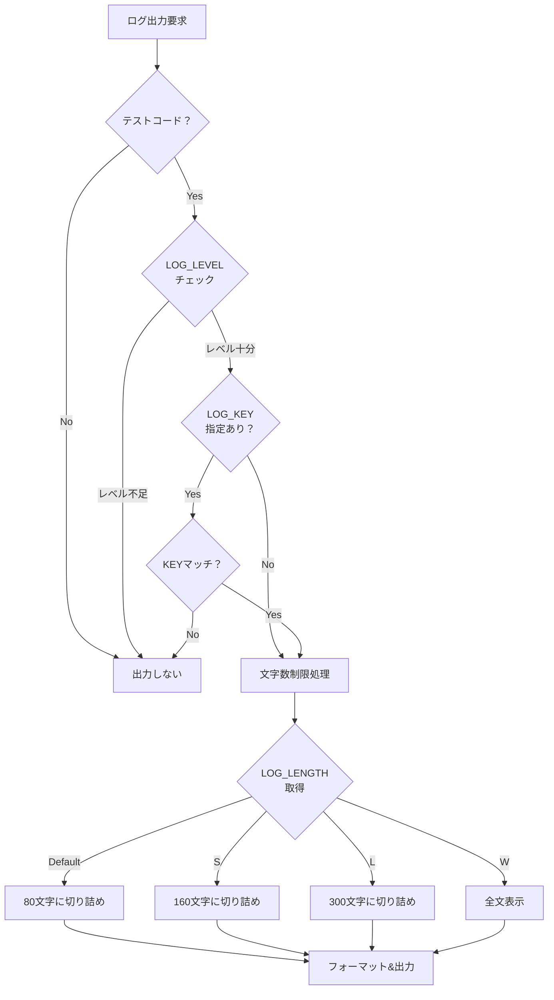
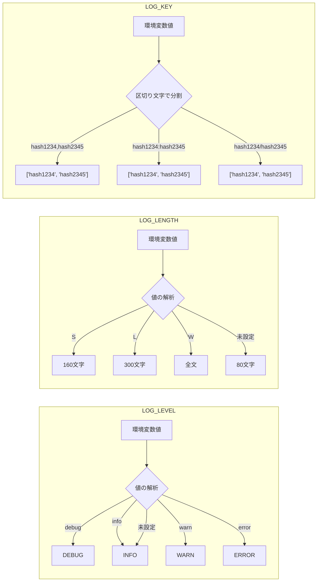
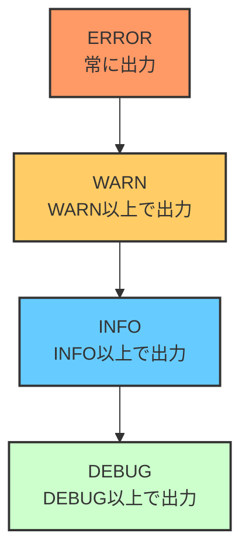

# BreakdownLogger 開発設計書

> **関連ドキュメント**: [仕様書 (en)](index.md) | [仕様書 (ja)](index.ja.md) |
> [用語集](glossary.ja.md)

## 1. 概要設計

### 1.1 システム構成

BreakdownLoggerは、テストコードのデバッグを支援するための軽量なロギングライブラリである。

#### 主要コンポーネント

1. **BreakdownLogger クラス**
   - ログ出力の中核となるクラス
   - 出力場所KEY（インスタンス識別子）を持つ
   - 環境変数に基づいたフィルタリング機能

2. **環境変数制御**
   - `LOG_LEVEL`: ログレベル制御
   - `LOG_LENGTH`: 出力文字数制御
   - `LOG_KEY`: 出力場所フィルタリング

3. **呼び出し元判定機能**
   - テストコード（*_test.ts）からの呼び出しのみ有効
   - 通常のコードからは動作しない

### 1.2 クラス設計



### 1.3 アーキテクチャ概要

```mermaid
flowchart TB
    subgraph TestCode[テストコード環境]
        Test[テストケース]
    end
    
    subgraph EnvVars[環境変数]
        LogLevel[LOG_LEVEL]
        LogLength[LOG_LENGTH]
        LogKey[LOG_KEY]
    end
    
    subgraph Library[BreakdownLogger]
        Instance[Logger Instance<br/>key: 'hash1234']
        Filter[フィルタリング処理]
        Format[フォーマット処理]
    end
    
    subgraph Output[出力]
        Stdout[標準出力]
        Stderr[エラー出力]
    end
    
    Test -->|new BreakdownLogger('hash1234')| Instance
    EnvVars --> Filter
    Instance --> Filter
    Filter -->|条件一致| Format
    Format --> Stdout
    Format -->|ERROR| Stderr
```

## 2. 詳細設計

### 2.1 基本的なログ出力フロー



### 2.2 フィルタリング処理の詳細



### 2.3 環境変数の解析処理



### 2.4 実装詳細

#### 環境変数の仕様

| 環境変数   | 値                                        | デフォルト | 説明                     |
| ---------- | ----------------------------------------- | ---------- | ------------------------ |
| LOG_LEVEL  | "debug" \| "info" \| "warn" \| "error"    | "info"     | ログレベルの制御         |
| LOG_LENGTH | "S" \| "L" \| "W"                         | (未設定)   | 出力文字数の制御         |
| LOG_KEY    | "key1,key2" \| "key1:key2" \| "key1/key2" | (未設定)   | 出力場所のフィルタリング |

#### 出力フォーマット

```typescript
// 基本フォーマット
[LEVEL] [key] message

// 実例
[DEBUG] [hash1234] デバッグメッセージ（最大80文字まで...

// dataがある場合
[DEBUG] [hash1234] デバッグメッセージ
Data: { "optional": "データ" }
Timestamp: 2024-03-10T12:00:00.000Z
```

#### テストコードの判定ロジック

**重要な仕様の明確化**

BreakdownLoggerは「テストファイル内」でのみ動作します。これは以下を意味します：

- **動作する**：`*_test.ts`、`*.test.ts`、`*_test.js`などのテストファイル内での呼び出し
- **動作しない**：`app.ts`、`main.ts`、`lib.ts`などの通常のアプリケーションファイル内での呼び出し
- **動作する**：テストファイル内の`Deno.test()`の内部・外部どちらでも
- **動作しない**：テストファイルをimportした通常ファイルからの呼び出し

この判定は、実行時のスタックトレースを解析してファイル名をチェックすることで実現します。「テスト環境変数がある」「CIで実行中」「開発環境である」などの環境要因では**ありません**。あくまでも呼び出し元のファイル名で判定します。

```typescript
function checkTestEnvironment(): boolean {
  // 方法1: スタックトレースから呼び出し元のファイル名を取得
  const stack = new Error().stack;
  return stack?.includes("_test.ts") || stack?.includes("_test.js") || false;

  // 方法2: Deno.testが定義されているかチェック（代替案）
  // return typeof Deno !== 'undefined' && typeof Deno.test === 'function';
}
```

### 2.5 メッセージ切り詰め処理

```typescript
function truncateMessage(message: string, maxLength: number): string {
  if (maxLength === -1) return message; // WHOLE

  if (message.length <= maxLength) {
    return message;
  }

  // 最後の3文字を"..."に置換
  return message.substring(0, maxLength - 3) + "...";
}

// 使用例
truncateMessage("これは非常に長いメッセージです", 30);
// => "これは非常に長いメッセージ..."
```

### 2.6 ログレベルの優先順位



## 3. 実装方針

### 3.1 ディレクトリ構造

```
breakdownlogger/
├── mod.ts              # エントリーポイント
├── src/
│   ├── constants.ts    # 定数定義
│   ├── environment_config.ts  # 環境変数設定管理
│   ├── log_filter.ts   # ログフィルタリング
│   ├── log_formatter.ts # ログフォーマット
│   ├── logger.ts       # BreakdownLoggerクラス
│   └── types.ts        # 型定義
├── tests/
│   ├── test_utils.ts   # テストユーティリティ
│   ├── logger_test.ts  # 基本テスト
│   ├── log_filter_test.ts      # フィルターテスト
│   ├── log_formatter_test.ts   # フォーマッターテスト
│   ├── environment_setup_test.ts       # 環境設定テスト
│   ├── environment_config_advanced_test.ts  # 環境設定詳細テスト
│   ├── integration_test.ts     # 統合テスト
│   ├── edge_cases_test.ts      # エッジケーステスト
│   ├── real_world_scenarios_test.ts    # 実使用シナリオテスト
│   ├── performance_test.ts     # パフォーマンステスト
│   └── formatter_coverage_test.ts      # フォーマッターカバレッジテスト
└── deno.json           # Deno設定
```

### 3.2 エクスポート設計

```typescript
// mod.ts
export { BreakdownLogger } from "./src/logger.ts";
export { LogLevel } from "./src/types.ts";
export { LogLength } from "./src/types.ts";
export type { LogEntry } from "./src/types.ts";
```

### 3.3 使用例

```typescript
// テストコード内での使用
import { BreakdownLogger } from "@scope/breakdownlogger";

Deno.test("設定の読み込みテスト", () => {
  const logger = new BreakdownLogger("config-loader-001");

  // 関数呼び出し前
  logger.debug("loadConfig開始", { path: configPath });

  const config = loadConfig(configPath);

  // 返り値の受け取り直後
  logger.debug("loadConfig完了", config);

  // 重要な加工処理の前
  logger.debug("パス解決処理開始", { basePath, relativePath });
  const resolvedPath = resolvePath(basePath, relativePath);
  // 重要な加工処理の後
  logger.debug("パス解決完了", { resolvedPath });
});
```

## 4. テスト計画

### 4.1 テストケース一覧

| カテゴリ     | テスト内容                 | 期待結果               |
| ------------ | -------------------------- | ---------------------- |
| 基本機能     | 各ログレベルメソッドの動作 | 正しくログが出力される |
| 環境変数     | LOG_LEVEL制御              | 指定レベル以上のみ出力 |
| 環境変数     | LOG_LENGTH制御             | 指定文字数で切り詰め   |
| 環境変数     | LOG_KEY制御                | 指定KEYのみ出力        |
| 呼び出し元   | テストコードから呼び出し   | ログ出力される         |
| 呼び出し元   | 通常コードから呼び出し     | ログ出力されない       |
| 区切り文字   | カンマ区切りKEY            | 正しく解析             |
| 区切り文字   | コロン区切りKEY            | 正しく解析             |
| 区切り文字   | スラッシュ区切りKEY        | 正しく解析             |
| エッジケース | 空文字列                   | エラーなく処理         |
| エッジケース | 巨大オブジェクト           | メモリ効率的に処理     |

### 4.2 パフォーマンス考慮事項

1. **メモリ効率**
   - ログエントリは即座に出力し、保持しない
   - 巨大なオブジェクトは文字列化前に切り詰め

2. **実行速度**
   - 環境変数はインスタンス生成時に読み込み、インスタンス内でキャッシュ
   - 出力判定は早期リターンで最適化

## 5. 制約事項

1. **依存関係**
   - Deno標準ライブラリのみ使用
   - 外部ライブラリへの依存なし

2. **互換性**
   - Deno 1.x以上をサポート
   - TypeScript/JavaScript両対応

3. **セキュリティ**
   - ログ出力時の機密情報は呼び出し側の責任
   - ファイル出力は行わない（標準出力のみ）

4. **バンドルサイズ**
   - 最小限の実装で10KB以下を目標
