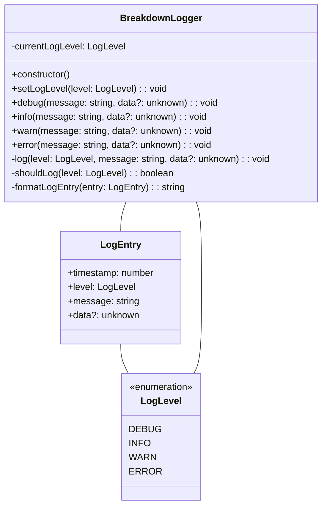
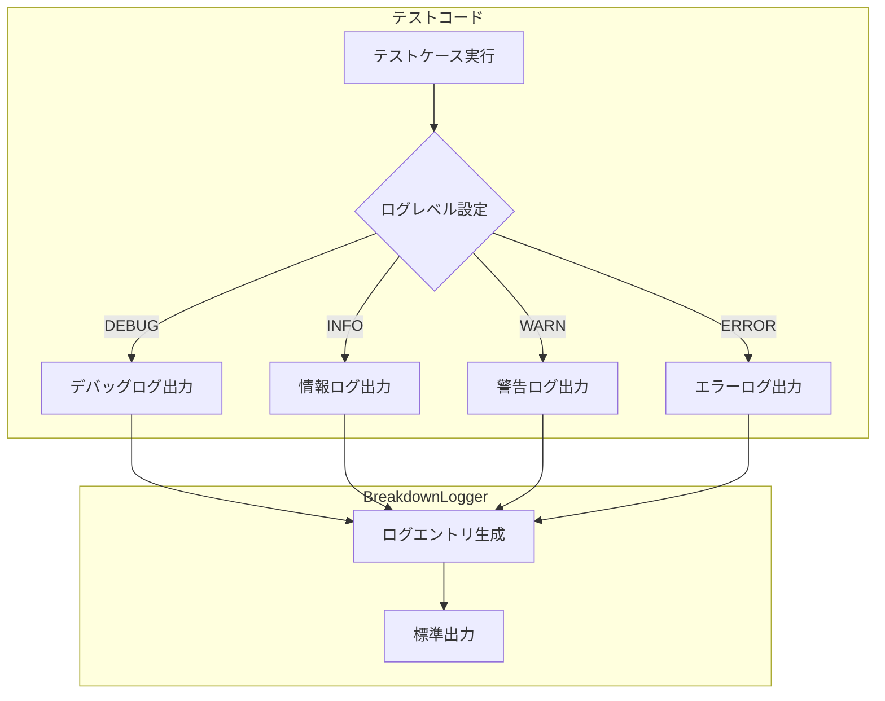
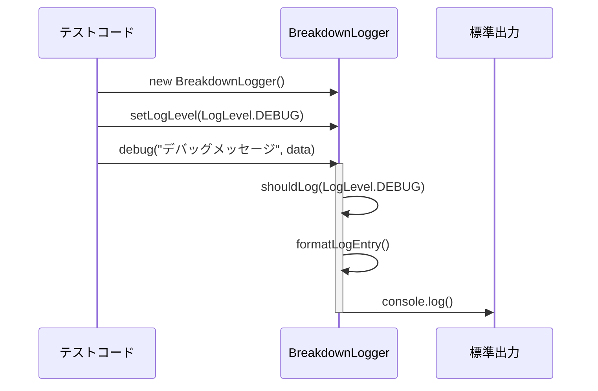
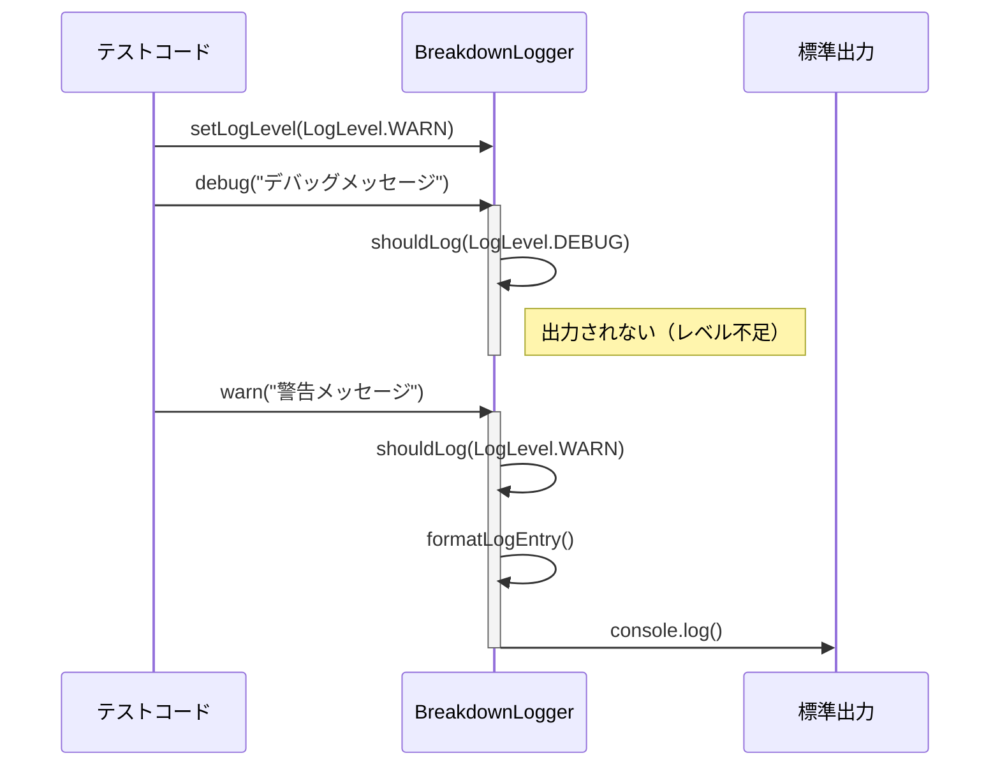
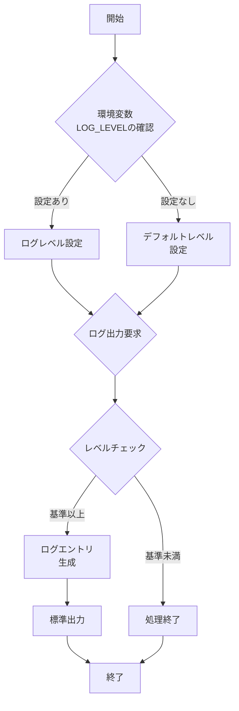
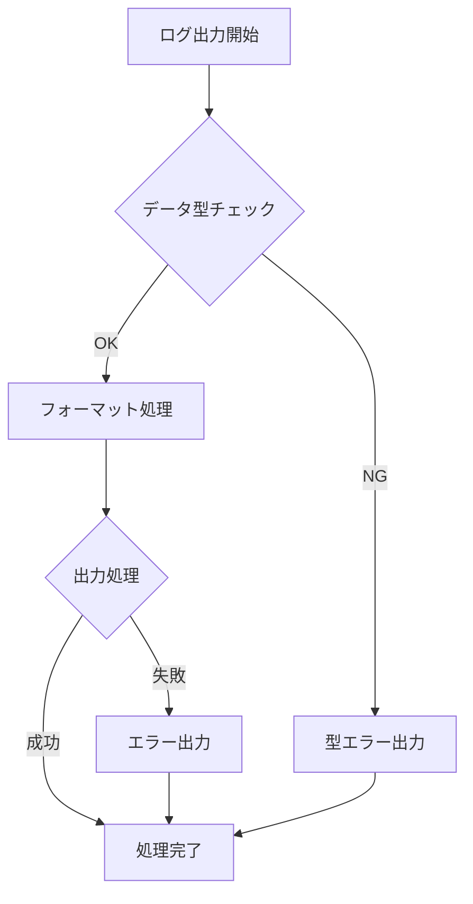
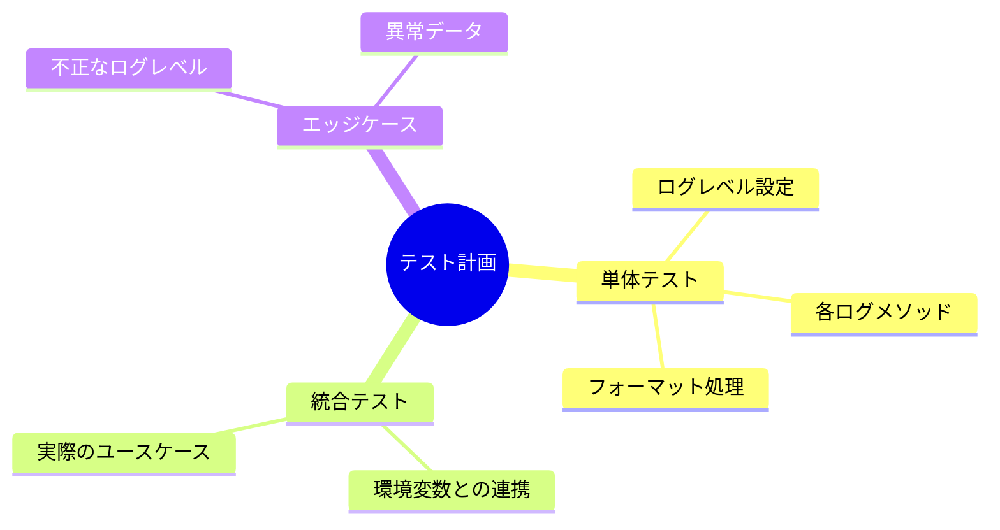

# 詳細設計書

## 1. システム概要

### 1.1 クラス図



### 1.2 ユースケース図



## 2. シーケンス図

### 2.1 基本的なログ出力フロー



### 2.2 ログレベルフィルタリング



## 3. 処理フロー

### 3.1 ログ出力の判断フロー



## 4. 実装詳細

### 4.1 環境変数

- `LOG_LEVEL`: ログレベルの設定
  - 値: "debug" | "info" | "warn" | "error"
  - デフォルト: "info"

### 4.2 出力フォーマット

```typescript
// ログエントリのフォーマット例
{
  timestamp: 1710000000000,
  level: "DEBUG",
  message: "デバッグメッセージ",
  data: { optional: "データ" }
}

// 出力形式
// [2024-03-10T12:00:00.000Z] [DEBUG] デバッグメッセージ
// データ: { "optional": "データ" }
```

### 4.3 エラーハンドリング



## 5. テスト戦略

### 5.1 テストケース



## 6. 制約事項と注意点

1. 実行環境
   - Deno実行環境のみをサポート
   - TypeScript/JavaScript互換性の維持

2. パフォーマンス
   - メモリ使用量の最小化
   - 不要なログ保持の回避

3. 拡張性
   - 将来的な機能追加を考慮したモジュール設計
   - インターフェースの安定性維持 